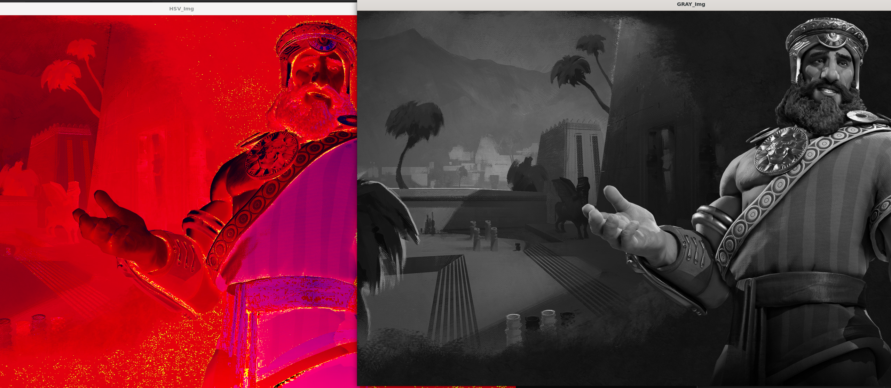

# <center>基础任务一

>使用opencv的at方法，操作图像的每个像素点，并实现一幅图像从RGB色彩空间转换成HSV色彩空间或灰度图；

## 实现思路

主要涉及到RGB转化灰度图和HSV的公式

要注意涉及到一些特殊情况，比如得到的HSV图像，其H、S、V三通道的取值范围并不是0 ~ 360、0 ~ 1、0 ~ 1，而是经过转换的0 ~ 180、0 ~ 255、0 ~ 255。

## 运行结果



## 代码实现
```cpp
#include <opencv2/opencv.hpp>
#include <iostream>

using namespace std;
using namespace cv;

int main()
{
    Mat inputImg = imread("../743449.jpg");
    if (inputImg.empty())
    {
        cout << "Error: Could not read the image." << endl;
        exit(-1);
    }

    Mat hsvImg(inputImg.size(), CV_8UC3);  //空的等大小的基画布
	Mat grayImg(inputImg.size(), CV_8UC1);
    for (int i = 0; i < inputImg.rows; i++)	// 对每一个像素进行操作
    {
        for (int j = 0; j < inputImg.cols; j++)
        {
			Vec3b tem, res;
            tem = inputImg.at<Vec3b>(i, j);
			/*HSV变换，基本是数学公式的代码表示*/
			int m, n;
			m = max(max(tem[0], tem[1]), tem[2]);
			n = min(min(tem[0], tem[1]), tem[2]);
			res[2] = m; //V
			int x = m - n; //max - min
			if(x)
			{
				res[1] = x / m;
			}
			else res[1] = 0; //S
			if (m == n)
                res[0] = 0; // 注意当分母等于0，不能继续计算，赋0值
			else
			{
				if(m == tem[2])
				{
					res[0] = 60*(tem[1] - tem[0]) / x;
				}
				else if(m == tem[1])
				{
					res[0] = 120 + 60*(tem[0] - tem[2]) / x;
				}
				else res[0] = 240 + 60*(tem[2] - tem[1]) / x;

			}
			
			if(res[0] < 0) res[0] += 360; //H

			res[0] /= 2; res[1] *= 255; res[2] *= 255;
			hsvImg.at<Vec3b>(i, j) = res;
			/*GRAY*/
			int Gray =  (tem[2]*299 + tem[1]*587 + tem[0]*114 + 500) / 1000;
			grayImg.at<uchar>(i, j) = Gray;
		}
    }

	imshow("GRAY_Img", grayImg);
    imshow("HSV_Img", hsvImg);
    waitKey(0);
}
```

