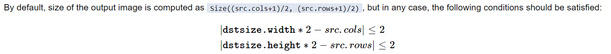
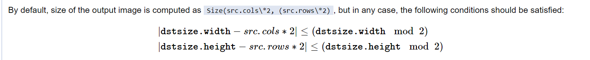
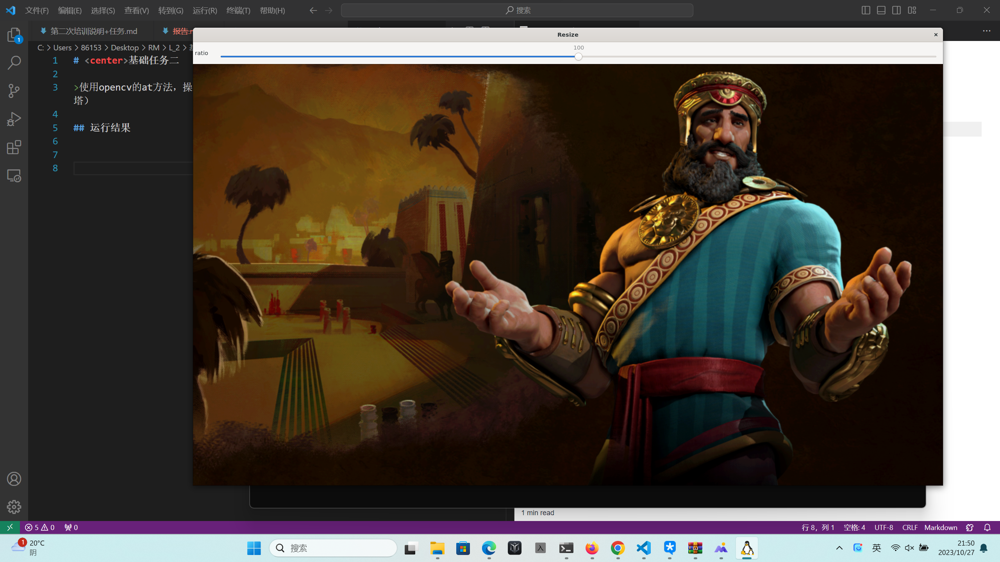
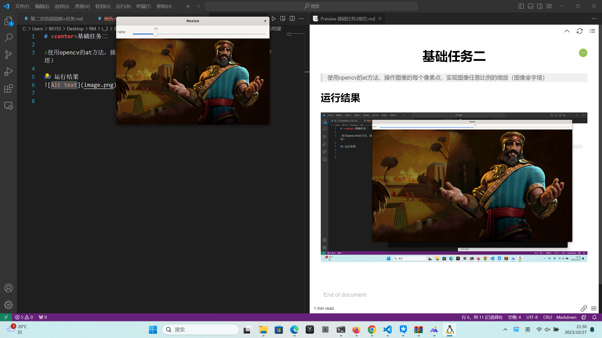
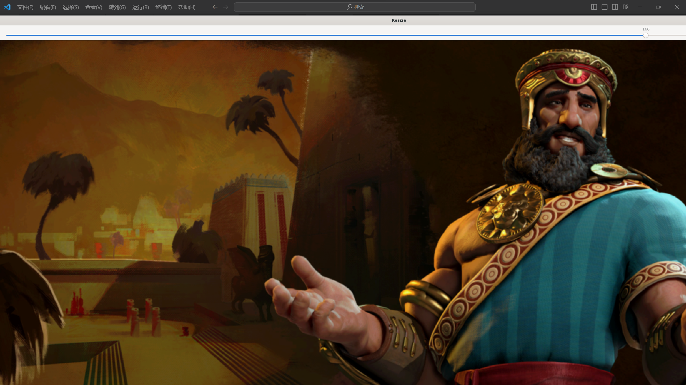

# <center>基础任务二

>使用opencv的at方法，操作图像的每个像素点，实现图像任意比例的缩放（图像金字塔）

## 实现思路

我采用了两种思路，一种是借鉴**图像金字塔**的实现方式，采取***向原图采样***，从目标图像出发，获取源图中的像素，同时利用***高斯滤核***来平滑

但在之前，我一直在想，图像金字塔pyrUp()，pyrDown()函数的实现似乎并不能实现“任意比例”
-（pyrDown()）

 -（pyrUp()）

因此我他也同时借鉴了Resize函数，用**双线性插值法**，原图像像素之间进行加权平均来估计目标图像中的新像素值，以实现图像的平滑缩放，从而以另一种方法实现任意比例放缩

## 运行结果




****

源代码
- 向原图采样
```cpp
#include <opencv2/opencv.hpp>
#include <opencv2/highgui/highgui.hpp>
#include <iostream>

using namespace std;
using namespace cv;

Mat gaussianKernel;  // 定义高斯核，可以在 main 函数中初始化

// 创建高斯核
Mat Guss(void)
{
    int kernelSize = 5;  // 高斯核大小
    double sigma = 1.0; 

    Mat kernelX = getGaussianKernel(kernelSize, sigma, CV_64F);
    Mat kernelY = getGaussianKernel(kernelSize, sigma, CV_64F);

    Mat py = kernelX * kernelY.t(); 
    return py;
}

// 滑动条回调函数
void myresize(int, void*) 
{
    int ratio = getTrackbarPos("ratio", "Resize");
    double scale = ratio / 100.0;
    Mat src = imread("../743449.jpg");  // 读取图像
    if (src.empty()) 
    {
        cout << "Read Image Error!" << endl;
        return;
    }
    int newrows = scale * src.rows, newcols = scale * src.cols;
    Mat dst = Mat::zeros(int(scale*src.rows),int(scale*src.cols),CV_8UC3);//初始化相同大小的空数组
    for(int i = 0; i < newrows; i ++)//开始采样
    {
        for(int j = 0; j < newcols; j ++)
        {
            int retrivex = i / scale;
            int retrivey = j / scale;
            Vec3b tem = {0, 0, 0};

            for(int k = -2; k < 3; k ++)//高斯滤核
            {
                for(int t = -2; t < 3; t ++)
                {
                    if (retrivex + k >= 0 && retrivex + k < src.rows && retrivey + t >= 0 && retrivey + t < src.cols)//防止越界
                    {
                        for(int c = 0; c < 3; c ++)
                        {
                            tem[c] += src.at<Vec3b>(retrivex + k, retrivey + t)[c] * gaussianKernel.at<double>(2 + k, 2 + t);
                        }
                    }
                }
            }
            for(int c = 0; c < 3; c ++)
                dst.at<Vec3b>(i, j)[c] = (int)tem[c];
        }
    }
    imshow("Resize", dst);

    return ;
}

int main() {
    gaussianKernel = Guss();  // 初始化高斯核

    namedWindow("Resize");
    int ratio = 100;
    createTrackbar("ratio", "Resize", &ratio, 200, myresize, NULL);//滑动条

    waitKey(0);
    return 0;
}
```


-  双线性插值法
```cpp
#include <opencv2/opencv.hpp>
#include <opencv2/highgui/highgui.hpp>
#include <iostream>

using namespace std;
using namespace cv;

// 图像双线性插值缩放函数
Mat my_resizeImage(const Mat& input, int newWidth, int newHeight)
{
    Mat output(newHeight, newWidth, input.type());

    for (int y = 0; y < newHeight; y++) 
    {
        for (int x = 0; x < newWidth; x++) 
        {   //借鉴双线性插值法
            float sourceX = (x + 0.5) * (input.cols / (float)(newWidth)) - 0.5;
            float sourceY = (y + 0.5) * (input.rows / (float)(newHeight)) - 0.5;

            int sourceX0 = (int)(sourceX);
            int sourceX1 = min(sourceX0 + 1, input.cols - 1);
            int sourceY0 = (int)(sourceY);
            int sourceY1 = min(sourceY0 + 1, input.rows - 1);

            float alpha = sourceX - sourceX0;
            float beta = sourceY - sourceY0;

            Vec3b pixel00 = input.at<Vec3b>(sourceY0, sourceX0);
            Vec3b pixel01 = input.at<Vec3b>(sourceY0, sourceX1);
            Vec3b pixel10 = input.at<Vec3b>(sourceY1, sourceX0);
            Vec3b pixel11 = input.at<Vec3b>(sourceY1, sourceX1);

            Vec3b interpolatedPixel;
            for (int c = 0; c < 3; c++) {
                interpolatedPixel[c] = static_cast<uchar>((1.0 - alpha) * (1.0 - beta) * pixel00[c] +
                                                          alpha * (1.0 - beta) * pixel01[c] +
                                                          (1.0 - alpha) * beta * pixel10[c] +
                                                          alpha * beta * pixel11[c]);
            }

            output.at<Vec3b>(y, x) = interpolatedPixel;
        }
    }

    return output;
}

// 滑动条回调函数
void myresize(int, void*) 
{
    int ratio = getTrackbarPos("ratio", "Resize");
    double scale = ratio / 100.0;
    Mat src = imread("../743449.jpg");  // 读取图像
    if (src.empty()) {
        cout << "Read Imagine Error!" << endl;
        exit(-1);
    }
    Mat resizedImage = my_resizeImage(src, (int)(src.cols * scale), (int)(src.rows * scale));
    imshow("Resize", resizedImage);
    waitKey(0);
}

int main() {

    namedWindow("Resize");
    int ratio = 10;
    createTrackbar("ratio", "Resize", &ratio, 200, myresize, NULL);

    return 0;
}
```

