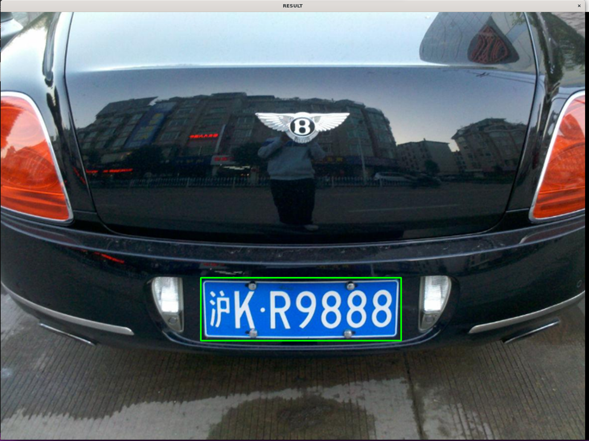

# <center>基础任务三

>调用opencv函数库，框选并提取出下列照片中的车牌；

   **用到的图像处理方法：色彩空间转换、二值化、形态学变换（膨胀腐蚀）、滤波、查找轮廓**

## 实现思路
读取图片后先进行色彩空间转化，转化为更灵敏的HSV，然后创建蓝色滤膜，过滤掉不在蓝色色域范围内的像素点，再用高斯滤波处理，然后对过滤后的图片进行二值化，之后利用形态学操作，先腐蚀再膨胀，让黑色区域中的细小白色连接部分消失，最后查找轮廓，找出矩形轮廓并在原彩色图中进行框选。

## 实现结果

>蓝色掩罩


>高斯滤波有细小的变化，变模糊光滑了

>腐蚀白色区域变小

>膨胀力度较大，直接全白

>二值化

>最终结果


源代码
```cpp
// /*用到的图像处理方法：色彩空间转换、二值化、形态学变换（膨胀腐蚀）、滤波、查找轮廓*/

#include <opencv2/opencv.hpp>

using namespace std;
using namespace cv;

int main() 
{

    Mat image = imread("/mnt/c/Users/86153/Desktop/RM/L_2/img/车牌3.png");

    // BGR to HSV 
    Mat hsv;
    cvtColor(image, hsv, COLOR_BGR2HSV);

    // 筛选色域范围
    Scalar lower_blue = Scalar(100, 150, 100);  
    Scalar upper_blue = Scalar(160, 255, 255);  

    // 蓝色掩罩
    Mat blue_mask;
    inRange(hsv, lower_blue, upper_blue, blue_mask);
    imshow("blue_Mask", blue_mask);
    // 高斯滤波
    Mat blurred_mask;
    GaussianBlur(blue_mask, blurred_mask, Size(3, 3), 0);
    imshow("blurred_mask",blurred_mask);

    //腐蚀
    Mat kernel_erode = getStructuringElement(MORPH_RECT, Size(5, 5));
    Mat eroded_mask;
    erode(blurred_mask, eroded_mask, kernel_erode);
    imshow("eroded_mask",eroded_mask);

    // 膨胀
    Mat kernel_dilate = getStructuringElement(MORPH_RECT, Size(30, 30));
    Mat dilated_mask;
    dilate(eroded_mask, dilated_mask, kernel_dilate);
    imshow("dilated_mask",dilated_mask);

    // 二值化
    Mat binary_mask;
    threshold(dilated_mask, binary_mask, 128, 255, THRESH_BINARY);
    imshow("Binary Mask", binary_mask);

    // findContours
    vector<vector<Point>> contours;
    findContours(binary_mask, contours, RETR_EXTERNAL, CHAIN_APPROX_SIMPLE);

    Mat image_with_rectangles = image.clone();

    for (const auto& contour : contours) //找出所有方框，事实上只有一个
    {
        Rect bounding_rect = boundingRect(contour);
        rectangle(image_with_rectangles, bounding_rect, Scalar(0, 255, 0), 3);
    }

    imshow("RESULT", image_with_rectangles);
    waitKey(0);

    return 0;
}

```


